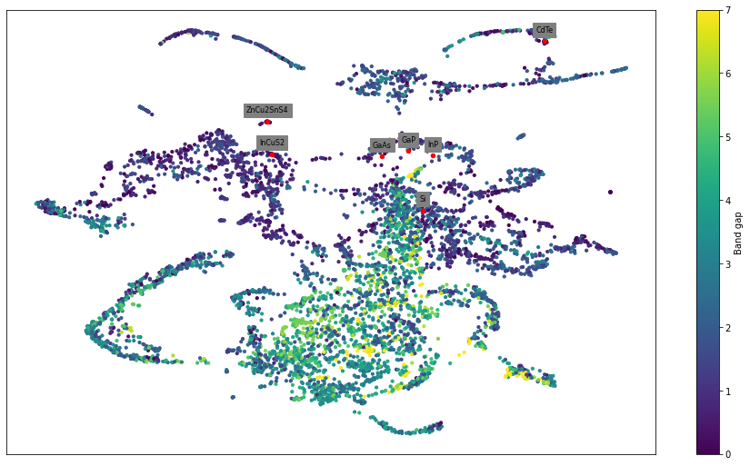

# Materials Graph Search

This repository contains some functions and utilities useful for turning a set of materials into a graph, each node representing each material, and then for searching within that graph possible new materials of a certain type by judging how similar they are to others. You can see a series of examples in the notebook [examples.ipynb](examples.ipynb).

All of the functions, properly documented, are inside of the file [graph_utilities.py](graph_utilities.py).

# Installation

For all of the functions in this repository to run it is necessary to have installed several dependencies, including [ForceAtlas2](https://github.com/bhargavchippada/forceatlas2) and [UMAP](hhttps://umap-learn.readthedocs.io/en/latest/) for the node positions calculation, ideally with Python 3.8:

`pip install numpy pandas tqdm scipy fa2 matplotlib plotly scikit-learn umap-learn numba jupyter`
